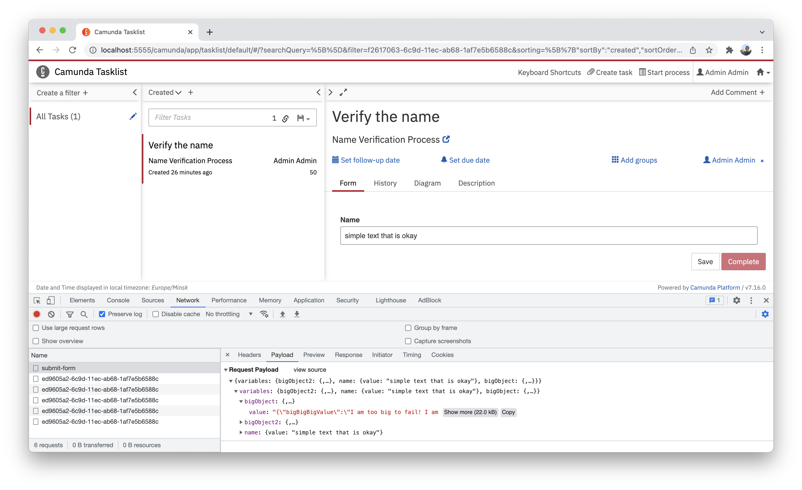
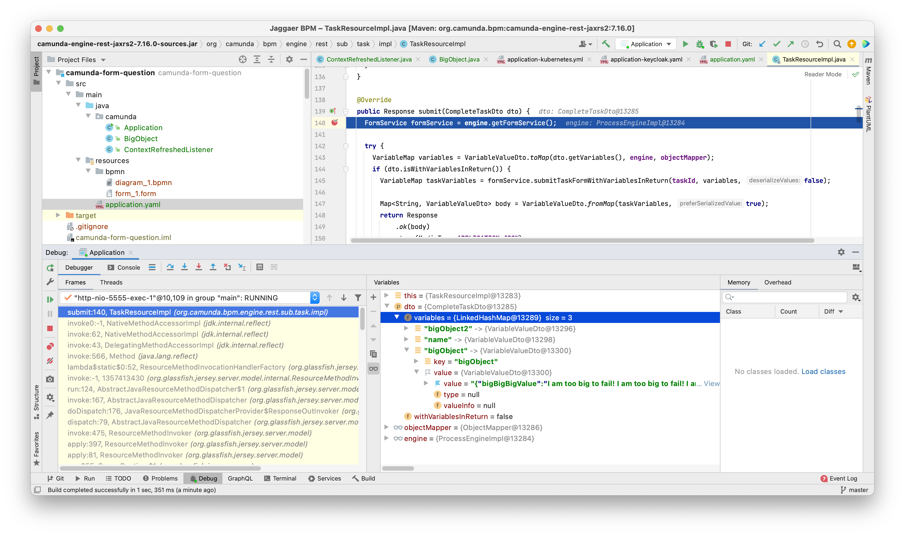

# Camunda Modeler Form and big value in the process problem.

We are using Camunda Modeler Forms and have some process with lots of variables. 
One of them (let name it bigValue) is a java object (we use SPIN for serialization) 
that have json representation of the value more than 4K symbols.

It is not problem to set up the bigValue programmatically, complete the task programmatically, 
but it is not possible to complete the task from Tasklist. It is failing with 
'Value too long for column "TEXT_ VARCHAR(4000)' exception.

Steps to reproduce.

1) Run this example (it will deploy and create instance of the process on the start, see the source code) 
2) Set up the breakpoint in org.camunda.bpm.engine.rest.sub.task.impl.TaskResourceImpl.submit method.
3) Open http://localhost:5555/, log in using admin/admin credentials.   
4) Find and complete the task in tasklist:

4) In both debuggers it is visible that 
   
   * ALL variables are coming from the form (even if they do not participate in the form!),
   * ALL variables have lost type parameter,
    
   so java object will be recognized as a string value,
   and this will produce the exception described above.
   

Is there a workaround for the Camunda Modeler Form or more correct usage? Usual HTML
forms do not have this problem, but reworking all forms to the plain HTML will take a lot of time.
